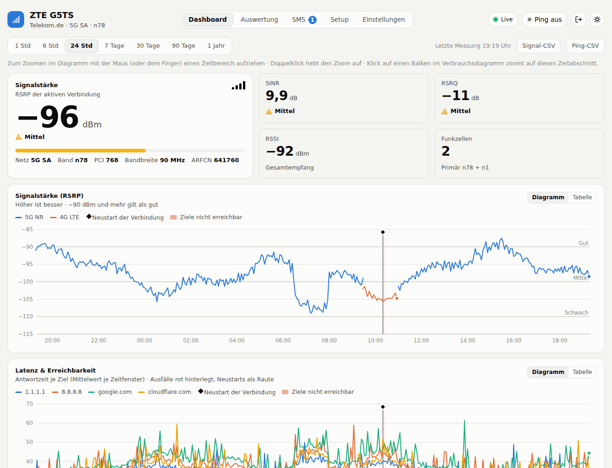
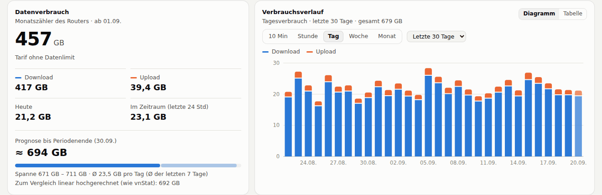
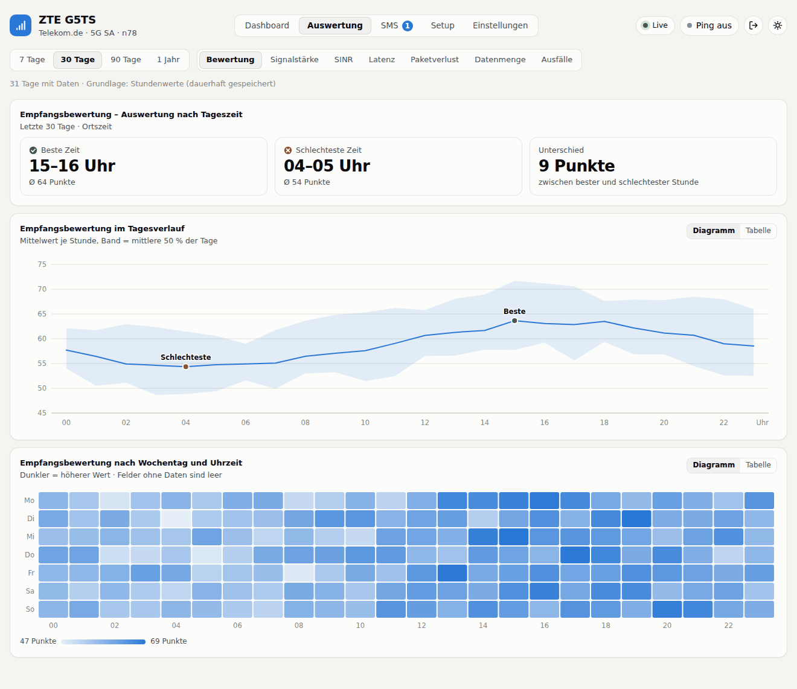
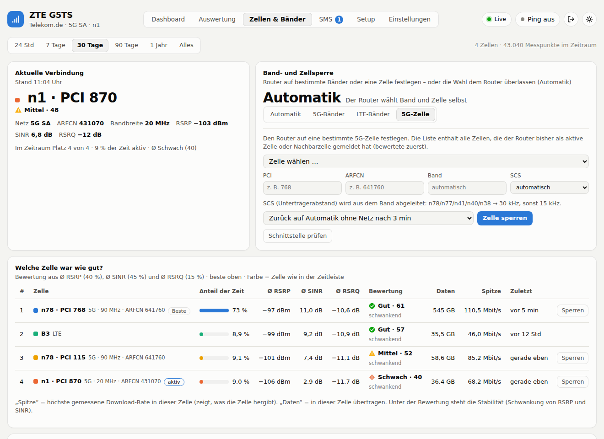
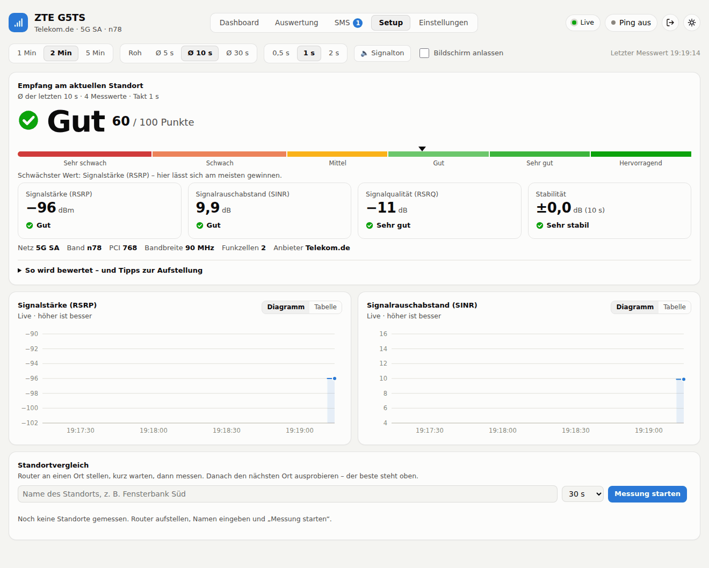
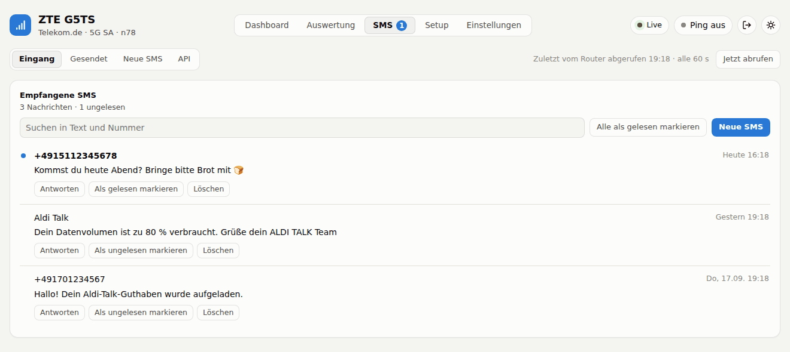
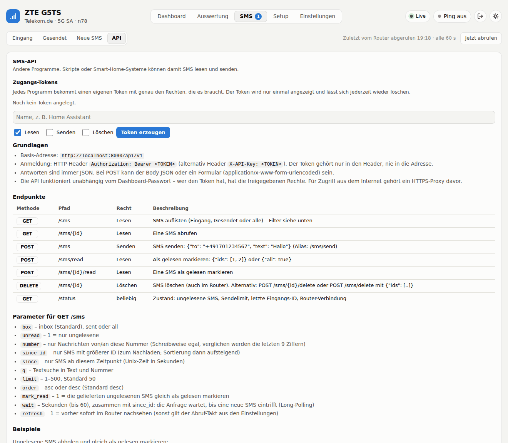
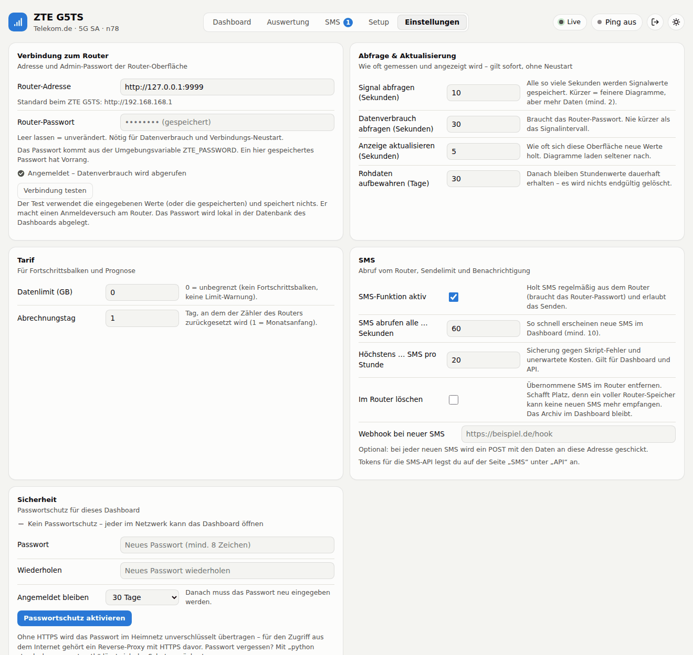

# ZTE G5TS Dashboard

Zeichnet Signalqualität (RSRP, RSRQ, SINR, RSSI, Band, Zelle, Trägeraggregation), Datenverbrauch, Latenz und Ausfälle
des ZTE G5TS / MC8830 (Aldi Talk) in SQLite auf und zeigt alles in einem Dashboard.
Nur Python-Standardbibliothek, keine Abhängigkeiten.

Seiten: **Dashboard** · **Auswertung** (nach Tageszeit) · **Zellen & Bänder** (Rangliste, Band-/Zellsperre) · **SMS** · **Setup** (Router-Standort finden) · **Einstellungen**.

*Dashboard: Signalstärke und -qualität, Latenz mit Ausfällen und Verbindungs-Neustarts (Beispieldaten aus dem Mock-Router).*

Weitere Ansichten

**Verbrauchsverlauf** mit wählbarer Auflösung (10 Min, Stunde, Tag, Woche, Monat) und Prognose:

**Auswertung nach Tageszeit** (Verlauf je Stunde und Heatmap Wochentag × Stunde):

**Zellen & Bänder** – welche Zelle war wie gut, und Router auf Bänder oder eine Zelle festlegen:

**Setup** – den besten Router-Standort finden (Bewertung in Worten, optional mit Ton):

**SMS** empfangen und senden, dazu eine Token-API für Skripte und Smart Home:

**Einstellungen** – alles ohne Neustart im Dashboard änderbar:

## Start

Das Ganze muss auf einem Gerät laufen, das den Router erreicht (Windows-PC, Raspberry Pi, NAS, Mini-PC, Docker-Host im Heimnetz).

    cp .env.example .env      # optional: ZTE_PASSWORD eintragen (geht auch später in den Einstellungen)
    docker compose up -d --build
    # -> http://<ip-des-geräts>:8080

Ohne Docker:

    ZTE_PASSWORD='…' python3 zte_dash.py

Windows (PowerShell):

    $env:ZTE_PASSWORD="dein-passwort"
    python zte_dash.py          # -> http://localhost:8080

Das Router-Passwort kann auch komplett in der Oberfläche unter **Einstellungen → Router-Verbindung** eingetragen werden
(danach ist die Umgebungsvariable nicht mehr nötig). Mit dem Knopf „Verbindung testen“ wird Login, Signal und Datenverbrauch geprüft.

**Wichtig beim Aktualisieren:** immer den ganzen Ordner `static` (enthält jetzt auch `login.html`) **und** `zte_dash.py` ersetzen. Die Datenbank (`data/`) bleibt unverändert.

## Docker-Image über GitHub bauen (Docker Hub)

Das Repo enthält `.github/workflows/docker.yml`: bei jedem Push auf `main` (und bei Tags wie `v1.0.0`) wird ein Multi-Arch-Image
(amd64 + arm64, also auch Raspberry Pi) gebaut und nach Docker Hub hochgeladen.

1. Repository auf GitHub anlegen und den Inhalt dieses Ordners hochladen (`.env` und `data/` sind per `.gitignore` ausgeschlossen).
2. In Docker Hub unter *Account Settings → Personal access tokens* ein Token mit der Berechtigung *Read, Write, Delete* erzeugen (Details unter Punkt 6).
3. In GitHub unter *Settings → Secrets and variables → Actions* zwei Secrets anlegen: `DOCKERHUB_USERNAME` und `DOCKERHUB_TOKEN`.
4. Push auslösen (oder *Actions → Docker Image → Run workflow*). Das Image heißt `<DOCKERHUB_USERNAME>/zte-dashboard`.
5. Starten: `docker run -d --name zte-dash -p 8080:8080 -v $(pwd)/data:/data <user>/zte-dashboard:latest`
   (das Volume `/data` enthält die Datenbank – nicht weglassen, sonst sind die Daten beim Neuanlegen des Containers weg).
6. **README auf Docker Hub:** Der Workflow überträgt nach jedem Build automatisch diese `README.md` als Beschreibung auf die Docker-Hub-Seite des Images
   (Bilder aus `docs/` werden dabei auf absolute GitHub-Adressen umgeschrieben, damit sie auch auf Docker Hub erscheinen).
   Dafür braucht das Docker-Hub-Token laut Dokumentation der verwendeten Action (`peter-evans/dockerhub-description`) die Berechtigung **Read, Write, Delete**.
   Das Repository auf GitHub muss öffentlich sein, sonst kann Docker Hub die Bilder nicht laden. Die Docker-Hub-Beschreibung ist auf 25 000 Byte begrenzt;
   diese README hat ca. 17 000 Byte. Wird sie größer, kürzt die Action automatisch und warnt im Log.

Hinweise: Der Container braucht nur Netzzugriff auf den Router (Standard `http://192.168.168.1`, per `-e ZTE_HOST=…` oder in den Einstellungen änderbar).
Den Port `8080` nicht ungeschützt ins Internet freigeben – vorher Passwortschutz aktivieren und HTTPS-Proxy davorsetzen.

## Einstellungen (alles im Dashboard)

Alle Werte lassen sich ohne Neustart ändern und gelten sofort:

- Router-Adresse und -Passwort, Abfrageintervall Signal, Intervall Datenverbrauch, Oberflächen-Aktualisierung, Rohdaten-Tage
- Tarifgrenze (0 = unbegrenzt) und Abrechnungstag
- SMS (Abruf-Takt, Sendelimit, Webhook, Router-Speicher leeren)
- Ping-Ziele (Host, ICMP/TCP, Port), Intervall, Timeout
- Watchdog (Schwellen, Schutzzeiten, Testmodus)
- Dashboard-Passwortschutz
- Manueller Verbindungs-Neustart

Vorrang: **Einstellungen im Dashboard > Umgebungsvariablen > Standardwerte.** Die Umgebungsvariablen dienen also nur als Startwerte.
Nur `ZTE_BIND` / `ZTE_PORT` (Adresse/Port des Dashboards) werden weiterhin ausschließlich per Umgebungsvariable oder Kommandozeile gesetzt.

Das Router-Passwort wird **unverschlüsselt in der lokalen Datenbank** (`data/zte.db`) abgelegt – die Datei also nicht weitergeben.

## Passwortschutz

Unter **Einstellungen → Sicherheit** aktivierbar (optional, standardmäßig aus). Ohne Anmeldung sind Dashboard und API gesperrt
(Seiten leiten auf `/login` um, die API antwortet 401).

- Passwort wird nur als PBKDF2-Hash (SHA-256, 200 000 Runden) gespeichert; Sitzung per signiertem Cookie (HttpOnly, SameSite=Strict), Laufzeit einstellbar.
- Passwortwechsel meldet alle Geräte ab. Fehlversuche werden je IP gebremst (ab 5 Fehlern 30 s Sperre, verdoppelt sich bis 15 min).
- Schreibende Aufrufe sind zusätzlich gegen CSRF geschützt.
- Startwert per Umgebungsvariable: `ZTE_DASH_PASSWORD` (wirkt nur, solange noch kein Schutz eingerichtet ist).
- **Passwort vergessen:** `python zte_dash.py --reset-auth` schaltet den Schutz wieder aus (Daten bleiben erhalten).
- Über normales HTTP im LAN wird das Passwort unverschlüsselt übertragen. Für Zugriff aus dem Internet einen Reverse-Proxy mit HTTPS
  (Caddy, nginx, Traefik) davorsetzen – dann setzt das Dashboard das Cookie automatisch als `Secure` (Header `X-Forwarded-Proto: https`).
  Beim Start warnt das Skript, wenn es ohne Passwort auf einer nicht-lokalen Adresse lauscht.

## Diagramme zoomen

- Im Diagramm mit der Maus einen Bereich aufziehen (Touch: wischen) → hineinzoomen.
- Über der Diagrammleiste: ◀ ▶ verschieben, Hinein / Heraus, Zurück (einen Zoom-Schritt), „Zoom aufheben“. Doppelklick setzt zurück.
- Klick auf einen Tag im Verbrauchs-Balkendiagramm zoomt auf diesen Tag.
- Bei langen Zeiträumen oder Bereichen außerhalb der Rohdaten-Frist werden automatisch die dauerhaften Stundenwerte benutzt.

## Ping-Statistik

Ziele stellst du unter Einstellungen ein. Jede Messung wird gespeichert. Das Latenz-Diagramm zeigt den Mittelwert je Ziel,
darunter eine Tabelle mit Aktuell / Ø / Min / Max / Jitter / Verlust. **Angezeigt werden nur Ziele, die aktuell in den Einstellungen stehen** –
alte Messwerte entfernter Ziele bleiben in der Datenbank, erscheinen aber nicht mehr (kommt das Ziel zurück, sind sie wieder da).
Der Ping läuft auf dem Rechner des Dashboards, gemessen wird also der ganze Weg Rechner → Router → Mobilfunk → Internet.
Fehlt das `ping`-Programm (oder die Berechtigung), fällt der Test automatisch auf TCP-Verbindungen (Port 443) zurück.

## Watchdog (standardmäßig AUS)

Fällt die Erreichbarkeit der Watchdog-Ziele aus, wird die Mobilfunkverbindung neu aufgebaut. Ausfälle erscheinen als
rot hinterlegte Bänder, Neustarts als Raute in allen Zeitdiagrammen und in der Ereignisliste.

- Auslöser: mehr als *X* aufeinanderfolgende fehlgeschlagene Ping-Runden **und** mehr als *Y* Sekunden seit dem ersten Fehler.
- Schutz: Wartezeit nach dem Neustart, Abkühlzeit zwischen Neustarts, Höchstzahl pro Stunde.
- Testmodus („dry run“): protokolliert nur, was passiert wäre.
- Neustart-Methode: der Netzmodus des Routers wird kurz umgeschaltet (z. B. 4G+5G → nur LTE → 4G+5G).
  Der ursprüngliche Modus wird gemerkt und beim nächsten Start wiederhergestellt, falls das Skript dazwischen beendet wird.
- **Vor dem ersten Einsatz** einmal `python zte_dash.py --test-reconnect` ausführen (trennt die Verbindung ca. 10–60 s).
  Diese Methode ist mit einem echten G5TS noch nicht geprüft.

## Auswertung nach Tageszeit

Aus den dauerhaften Stundenwerten: Verlauf je Stunde (0–23 Uhr) und Heatmap Wochentag × Stunde für Signal (RSRP, SINR, RSRQ),
Durchsatz/Verbrauch, Latenz, Paketverlust und Ausfälle, dazu beste/schlechteste Stunde. Zeigt z. B., ob abends die Zelle überlastet ist.

## Zellen & Bänder – Rangliste und Band-/Zellsperre

Die Seite **Zellen & Bänder** zeigt für einen wählbaren Zeitraum (24 Std bis „Alles“):

- **Aktuelle Verbindung** mit Bewertung und Platz in der Rangliste.
- **Rangliste der Zellen** (Band · PCI · ARFCN): Anteil der Zeit, Ø RSRP/SINR/RSRQ, Bewertung (gleiche Formel wie auf der Setup-Seite),
  Stabilität, in der Zelle übertragene Daten und die höchste gemessene Download-Rate („Spitze“).
- **Zeitleiste**: je Zelle eine Spur, farbige Abschnitte = Zeit, in der die Zelle aktiv war; Rauten markieren Änderungen an der Sperre.
- **Bänder im Vergleich** und **Zellen in Reichweite** (aktive Zellen, Zusatzträger und Nachbarzellen aus `nr_neighbor_cell`).
  Für Nachbarzellen liefert der Router keine Signalwerte – eine Bewertung gibt es erst, wenn die Zelle einmal aktiv war.

Die Werte je Zelle werden als Stundenwerte dauerhaft gespeichert (`cells_h`), der Datenverbrauch wird der jeweils aktiven Zelle zugeordnet.
Beim ersten Start mit dieser Version werden vorhandene Daten automatisch übernommen.

### Sperre setzen

Unter **Band- und Zellsperre**: **Automatik** · **5G-Bänder** (SA) · **LTE-Bänder** · **5G-Zelle** (PCI + ARFCN, Band und SCS werden abgeleitet).
In der Rangliste und der Nachbarliste setzt „Sperren“ die Zelle direkt ins Formular. Braucht das Router-Passwort.

- Die Befehle stecken in der Firmware (`zte_nwinfo_api`: `nwinfo_set_sa_bandlock`, `nwinfo_lock_nr_cell`, `nwinfo_set_lte_ext_band`,
  `nwinfo_reset_band_cell_setting`), die Router-Oberfläche zeigt sie aber nicht an. Die Argumentnamen fragt das Dashboard per ubus `list` ab;
  liefert der Router keine Liste, werden bekannte Schreibweisen probiert. **Jede Änderung wird danach über `nwinfo_get_netinfo` geprüft** –
  erst eine sichtbare Änderung gilt als übernommen.
- **Sicherheitsnetz:** Findet der Router mit der Sperre länger kein Netz (einstellbar 1–10 min, Standard 3 min), stellt das Dashboard
  automatisch auf Automatik zurück und trägt das in die Ereignisse ein.
- Beim Umschalten ist die Verbindung kurz (ca. 10–60 s) weg.
- **Noch nicht an einem echten G5TS geprüft** (nur mit dem Mock-Router). Vor dem ersten Einsatz einmal
  `python zte_dash.py --probe-lock` ausführen – das ändert nichts, zeigt aber die Sperr-Befehle samt Argumenten und den aktuellen Zustand.
  Dieselbe Abfrage gibt es auf der Seite unter „Schnittstelle prüfen“.

## Setup – besten Router-Standort finden

Die Seite liest das Signal hochfrequent (0,5–5 s wählbar; die Signalwerte kommen ohne Router-Login) und bewertet es in Worten:
**Hervorragend · Sehr gut · Gut · Mittel · Schwach · Sehr schwach**.

Bewertung (Punkte 0–100): SINR 45 %, RSRP 40 %, RSRQ 15 % (jeweils interpoliert); ab 85 Hervorragend, ab 70 Sehr gut, ab 55 Gut, ab 40 Mittel, ab 20 Schwach.
Zusätzlich wird die Stabilität (sehr stabil … unruhig) aus der Schwankung der letzten Werte angezeigt.

Vorgehen:

1. Setup-Seite auf dem Handy/Tablet öffnen (Dashboard-Rechner muss im selben Netz erreichbar sein), Bildschirm bleibt an (Wake Lock).
2. „Ton“ einschalten: Die Tonhöhe folgt der Bewertung, so kann man den Router bewegen, ohne auf den Bildschirm zu schauen.
3. Am Standort „Messung“ starten (15 / 30 / 60 / 120 s) und benennen (z. B. „Fenster Süd“). Die Standorte werden mit Mittelwert, Streuung und Rang verglichen
   (Rang = Mittelwert − ½ × Streuung, stabile Plätze gewinnen also gegenüber schwankenden).
4. Den Standort mit dem besten Rang wählen. Messungen bleiben gespeichert und lassen sich löschen.

Hinweis: Nach dem Umstellen des Routers braucht das Modem ein paar Sekunden, bis Band/Zelle stabil sind – Messung erst dann starten.

## SMS empfangen und senden

Seite **SMS** im Dashboard: **Eingang** (mit Ungelesen-Zähler im Menü), **Gesendet**, **Neue SMS** (mit Zeichen- und Teile-Zähler) und **API**.
Das Dashboard holt SMS im eingestellten Takt (Standard 60 s, „Jetzt abrufen“ geht sofort) aus dem Router und archiviert sie in der Datenbank.
Neue SMS erscheinen auch in der Ereignisliste. Gelöschte SMS verschwinden im Dashboard und im Router.

- Voraussetzung: Router-Passwort (Abruf und Versand brauchen den Login). Einstellungen → **SMS**: an/aus, Abruf-Takt, **Sendelimit pro Stunde** (Standard 20, schützt vor Skript-Fehlern und Kosten),
  optional „Im Router löschen“ (schafft Platz im Router-Speicher; das Archiv im Dashboard bleibt) und ein **Webhook**, der bei jeder neuen SMS ein `POST {"event":"sms_received","message":{…}}` bekommt.
- Kodierung: Text ohne Sonderzeichen geht als GSM-7 (160 / 153 Zeichen je Teil), mit Sonderzeichen oder Emoji als Unicode (70 / 67). Höchstens 6 Teile je SMS; jeder Teil zählt beim Anbieter als eigene SMS.
- Die Schnittstelle des Routers (ubus-Objekt `zwrt_wms`: `zte_libwms_get_sms_data`, `zte_libwms_send_sms`, `zwrt_wms_delete_sms`) ist nach der Beschreibung aus der Community umgesetzt und
  mit dem Mock-Router getestet, **aber noch nicht an einem echten G5TS**. Vor dem ersten Einsatz: `python zte_dash.py --probe-sms` (zeigt Methoden und Aufbau der Antworten ohne Nachrichtentexte),
  dann im Dashboard „Jetzt abrufen“ und zuerst eine SMS an die eigene Handynummer senden.
- **Verschlüsselte SMS-Felder:** Neuere Firmware (z. B. G5TS/MC8830) verschlüsselt Rufnummer und Text auf der ubus-Schnittstelle mit AES-256-GCM. Das Dashboard macht denselben
  Schlüsselaustausch wie die Weboberfläche (RSA-Schlüssel des Routers holen, zufälligen Sitzungsschlüssel übergeben) – komplett in Python, ohne zusätzliche Pakete.
  Der Schlüssel gilt je Router-Sitzung und wird nach jedem neuen Login automatisch neu ausgehandelt. Firmware ohne Verschlüsselung wird erkannt und im Klartext bedient.
  Hinweis: Öffnest du gleichzeitig die SMS-Seite der Router-Weboberfläche, kann es sein, dass dort kurz keine Texte erscheinen (Seite neu laden).
- Meldet der Router beim Senden „ubus-Status 2“ (ungültige Argumente), probiert das Dashboard nacheinander mehrere Schreibweisen der Argumente (Zeitzone in Stunden oder Viertelstunden,
  Trennzeichen, id). Bei „Status 2“ wird dabei nie etwas gesendet; die erste akzeptierte Variante wird gemerkt. `--test-sms NUMMER` zeigt alle Versuche.
- Zeitangaben der Nachrichten liest das Dashboard als Viertelstunden-Zeitzone (`+8` = MESZ); früher falsch gelesene oder verschlüsselt importierte Einträge werden beim nächsten Abruf automatisch berichtigt.

### SMS-API für Skripte und Smart Home

Unter **SMS → API** legst du **Tokens** an (Name + Rechte Lesen / Senden / Löschen; der Token wird nur einmal angezeigt, gespeichert wird nur sein Hash). Die Beschreibung mit Beispielen steht dort ebenfalls.
Kurzform (Basis `http://<dashboard>:8080/api/v1`, Header `Authorization: Bearer <TOKEN>`):

    GET    /sms?box=inbox|sent|all&unread=1&number=…&since_id=…&since=…&q=…&limit=50&order=asc|desc&mark_read=1&wait=30&refresh=1
    GET    /sms/{id}
    POST   /sms            {"to": "+491701234567", "text": "Hallo"}      (Recht: Senden)
    POST   /sms/read       {"ids": [1,2]}  oder  {"all": true}
    DELETE /sms/{id}       (auch: POST /sms/{id}/delete, POST /sms/delete {"ids": [..]})
    GET    /status         ungelesen, Sendelimit, letzte Eingangs-ID, Router-Zustand

    curl -H "Authorization: Bearer $TOKEN" "http://<dashboard>:8080/api/v1/sms?unread=1&mark_read=1"
    curl -X POST http://<dashboard>:8080/api/v1/sms -H "Authorization: Bearer $TOKEN" -H "Content-Type: application/json" -d '{"to":"+491701234567","text":"Hallo!"}'

Mit `since_id=<letzte ID>&wait=30` wartet die Anfrage bis zu 30 s auf eine neue SMS (Long-Polling). Fehlercodes: 400 Eingabe, 401 Token, 403 Recht, 404, 409 Router-Passwort fehlt, 429 Sendelimit / zu viele ungültige Tokens, 502 Router.
Die API gilt unabhängig vom Dashboard-Passwort – für Zugriff aus dem Internet einen HTTPS-Proxy davorsetzen.

## Verbrauchsverlauf in wählbarer Auflösung

Das Verbrauchsdiagramm (Download/Upload) hat eigene Schalter **10 Min · Stunde · Tag · Woche · Monat** und einen Zeitraum (z. B. letzte 24 Std / 7 Tage / 30 Tage / 1 Jahr) – unabhängig von der Zeitraum-Auswahl oben.
Beim Zoomen zeigt es den gewählten Ausschnitt und wählt bei Bedarf automatisch eine passende Auflösung; ein Klick auf einen Balken zoomt auf diesen Abschnitt.
10-Minuten-Werte gibt es nur, solange die Rohdaten aufbewahrt werden (Standard 30 Tage), Stundenwerte, Tage, Wochen und Monate dauerhaft. Wochen beginnen am Montag.

## Prognose Periodenende

Grundlage ist der Monatszähler des Routers. Schätzung = bisher verbraucht (ohne heute) + max(heute, Tagesschnitt) + Tagesschnitt × verbleibende Tage.
Tagesschnitt = Mittel der letzten bis zu 7 vollständigen Tage. Angezeigt werden Spanne (25./75. Perzentil), Güte (gut/mittel/grob)
und zum Vergleich die lineare Hochrechnung.

## Datenhaltung – es wird nichts gelöscht

Rohwerte (Signal, Durchsatz, Pings) werden `raw_days` Tage (Standard 30) gehalten; vorher werden sie zu **Stundenwerten** verdichtet, die dauerhaft bleiben.
Tagesverbrauch, Ereignisse, Ausfälle, Neustarts und Setup-Messungen werden dauerhaft gespeichert. Der Router-Zähler startet am 1. neu, die Historie bleibt.
Export: `/api/export.csv?range=30d&kind=signal|ping` (auch mit `from`/`to`; Links im Dashboard).

## Hinweise

- **Signalwerte** kommen ohne Login vom Router. **Datenverbrauch** und **Neustart** brauchen das Admin-Passwort.
- Der Router erlaubt meist nur eine Admin-Sitzung: Loggst du dich parallel in der Router-Oberfläche ein,
  kann das Dashboard kurz ausgeloggt werden und loggt sich beim nächsten Abruf automatisch neu ein.
- Nach 2 abgelehnten Router-Logins pausiert das Skript 30 Minuten (der Router sperrt nach 5 Fehlversuchen). Beim Ändern von Adresse/Passwort wird diese Pause zurückgesetzt.
- Docker: Das Image enthält `ping`.

## Diagnose

    python3 zte_dash.py --probe
    python3 zte_dash.py --probe-sms     # SMS-Schnittstelle des Routers
    python3 zte_dash.py --probe-lock    # Band-/Zellsperre: Befehle, Argumente, aktueller Zustand (ändert nichts)
    python3 zte_dash.py --test-sms +491701234567   # EINE Test-SMS senden und zeigen, welche Schreibweise der Router akzeptiert

Loggt sich ein und listet, was der Router liefert (Antwort von `get_wwandst`, verfügbare ubus-Objekte).
Wenn der Datenverbrauch leer bleibt: Ausgabe von `--probe` schicken, dann lässt sich der Parser anpassen.

## Testen ohne Router

    python3 dev/mock_router.py --seed data/demo.db --days 60     # 60 Tage Demo-Daten (inkl. Ausfälle)
    python3 dev/mock_router.py --port 9999 &                     # Fake-Router (Passwort: demo)
    curl http://127.0.0.1:9999/mock/locksig?on=1                 # optional: Mock meldet die Sperr-Befehle per ubus list
    ZTE_HOST=http://127.0.0.1:9999 ZTE_PASSWORD=demo ZTE_DB=data/demo.db python3 zte_dash.py
